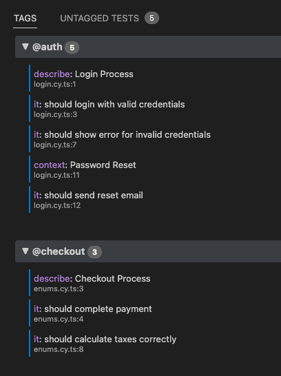

# Cypress Tags Explorer

A powerful VS Code extension to easily manage, view, and organize Cypress tags right within your editor.



## Features

- **Full-page Webview**: Experience a clean, native-looking interface built with the VS Code Webview UI Toolkit.
- **AST Parsing**: Automatically parses your Cypress files (`describe`, `context`, `it` blocks) to extract tags without executing any code.
- **Tag Inheritance**: Accurately reflects Cypress tag inheritance. Tags applied to a `describe` block automatically cascade down to its `it` blocks.
- **Enum Resolution**: Supports both plain string tags (e.g., `'@smoke'`) and Enums (e.g., `Priority.HIGH`). It intelligently traces imports across your workspace to resolve the underlying string values of enums.
- **Organized Overview**: Displays all discovered tags sorted alphabetically, along with a count of tests associated with each tag. Tests without tags are conveniently grouped in an "Untagged" section.
- **Click-to-Open**: Click on any test in the list to instantly jump to the corresponding line in your editor, making it effortless to add or reassign tags.
- **Inline Renaming**: Rename tags across your entire workspace directly from the UI. The extension safely updates your code using native VS Code `WorkspaceEdit` features, preserving your formatting.

## Usage

1. Open the Command Palette in VS Code (`Cmd+Shift+P` on macOS or `Ctrl+Shift+P` on Windows/Linux).
2. Search for and execute the command: **"Cypress Tags Explorer: Open"**.
3. The Tags Explorer webview will open, displaying all tags and tests in your configured Cypress directory.

## Setup & Configuration

By default, the extension scans the `cypress/e2e` folder for `*.cy.ts` and `*.cy.js` files. 
You can customize this behavior in your VS Code `settings.json`:

```json
{
  "tagsExplorer.cypressFolder": "cypress/e2e",
  "tagsExplorer.fileExtensions": "*.cy.ts,*.cy.js"
}
```

## How to Run locally

1. Clone this repository and open the folder in VS Code.
2. Run `npm install` to install dependencies.
3. Press `F5` to open a new window with the extension loaded (Extension Development Host).
4. In the new window, open the Command Palette (`Cmd+Shift+P` on Mac / `Ctrl+Shift+P` on Windows) and run **"Cypress Tags Explorer: Open"**.
